[linkedin](https://www.linkedin.com/in/manmohan-hunjan/) &nbsp;·&nbsp;
[email](mailto:manmohan.hunjan.mh@gmail.com)

> CS student at San Francisco State, in the SF Bay Area. 
> Small, sharp tools over big vague ideas.

I build fast, test on real users, and kill what doesn't work. Right now that's 
[autobroll](https://github.com/andriidrok1/autobroll) — an AI short-form video editor that runs in the browser. Also 
deep into markets: Pine Script indicators, backtesting, on-chain data.

<samp>python &nbsp; typescript &nbsp; javascript &nbsp; react &nbsp; node &nbsp; three.js &nbsp; fastapi &nbsp; postgres &nbsp; docker &nbsp; git &nbsp; linux</samp>

**[autobroll](https://github.com/andriidrok1/autobroll)** &nbsp;·&nbsp; <samp>typescript, remotion</samp> 
AI short-form video editor in the browser. Auto captions with accents, 
drag-and-retime editing, b-roll placement: transcript in, rendered video out.

**[strategy-checker](https://github.com/andriidrok1/strategy-checker)** &nbsp;·&nbsp; <samp>python</samp> 
Describe a trading strategy in plain English, get a real backtest with 
statistical validation. Exposes curve-fitting, not alpha.

**[compound](https://github.com/andriidrok1/compound)** &nbsp;·&nbsp; <samp>typescript, convex</samp> 
Autonomous research agent for your second brain. Built solo at Nozomio 
Hackathon, EF SF.

**[andriidrok.com](https://andriidrok.com)** &nbsp;·&nbsp; <samp>three.js, webgl</samp> 
Particle-morph portfolio: thousands of particles reshaping between scenes.

